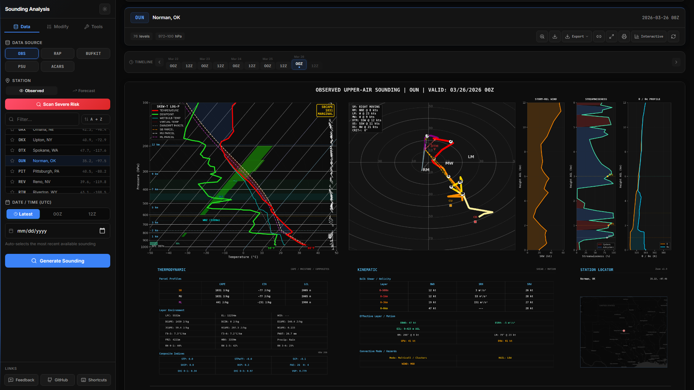
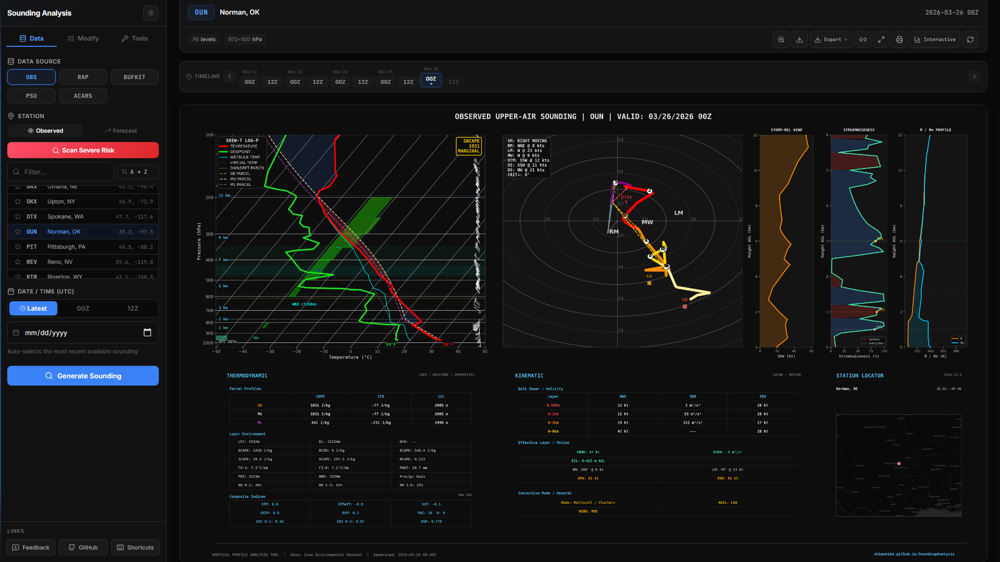
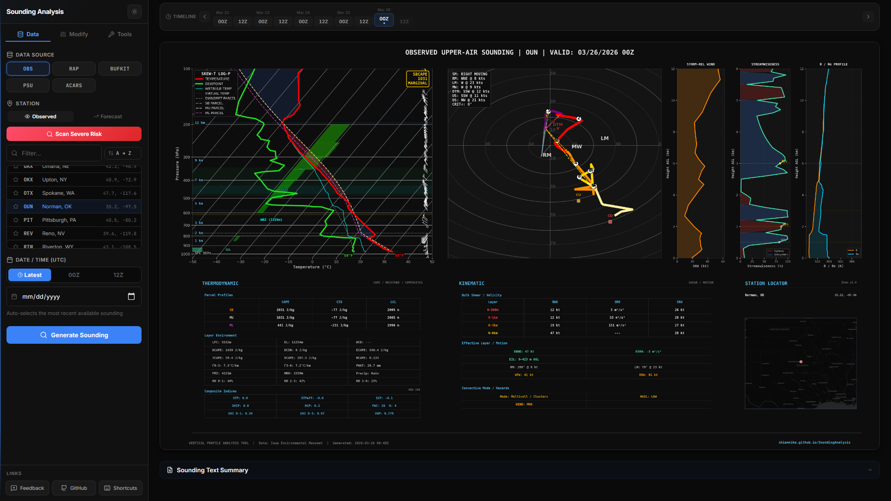
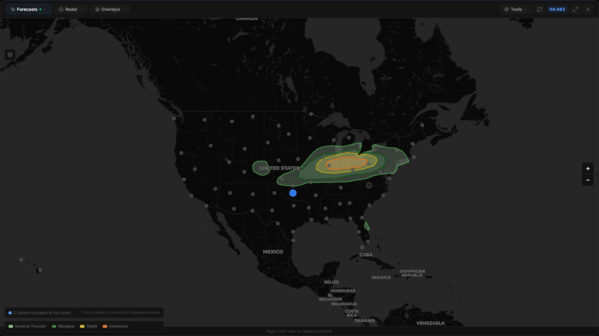
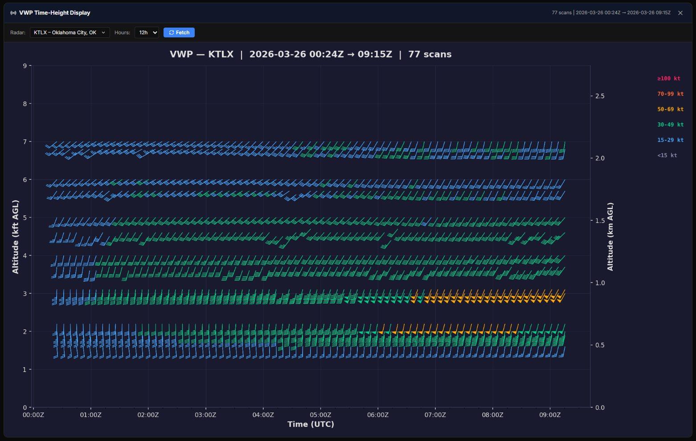
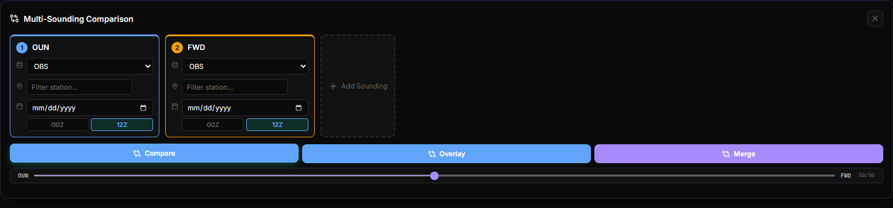
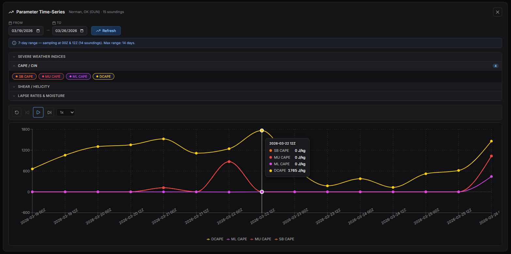
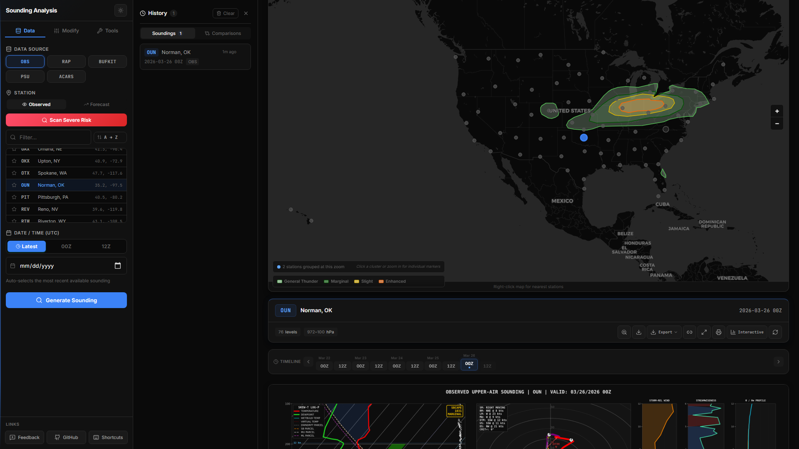

# Sounding Analysis Tool

[](https://github.com/ShianMike/SoundingAnalysis/commits/main)
[](https://github.com/ShianMike/SoundingAnalysis/stargazers)
[](https://github.com/ShianMike/SoundingAnalysis/forks)
[](https://www.python.org/)
[](https://react.dev/)
[](https://soundinganalysis-752306366750.asia-southeast1.run.app)
[](https://shianmike.github.io/SoundingAnalysis/)
[](#license)
[](https://unidata.github.io/MetPy/)

A full-stack atmospheric sounding analysis application that fetches real upper-air data from multiple sources and produces comprehensive Skew-T / Hodograph analysis plots.

**Live site:** <https://shianmike.github.io/SoundingAnalysis/>

---

## Screenshots

### Dashboard
The main interface — sidebar control panel on the left with data source selection, station picker, date/time controls, and modification options. Results display on the right.



### Sounding Plot (Dark Theme)
Full Skew-T Log-P diagram with hodograph, storm-relative wind/vorticity profiles, theta/theta-e panel, and computed parameters:



### Parameters & Climatology
Computed thermodynamic, kinematic, and composite parameters displayed as color-coded cards with severity thresholds. Climatology percentile bars show how each parameter ranks against SPC severe-weather proximity sounding climatology:



### Station Map with NEXRAD Radar
Interactive dark-themed Leaflet map with station markers, NEXRAD reflectivity mosaic overlay, SPC convective outlook polygons, and click-to-select functionality:



### VWP Time-Height Display
NEXRAD VAD wind barbs across time and height — searchable radar dropdown sorted by proximity, configurable time window (3–24h):



### Multi-Sounding Comparison
Compare up to 4 soundings side-by-side with full Skew-T plots and a parameter comparison table highlighting differences:



### Parameter Time-Series Charts
Plot CAPE, SRH, STP, shear, lapse rates, and more over a configurable date range (up to 14 days). Grouped parameter selector with dark-themed Recharts line charts:



### Sounding History
Auto-saved last 20 soundings with one-click reload. Tabbed view for soundings and comparisons with relative timestamps:



### Light Theme
Toggle between dark and light themes — fully consistent styling across all panels and plots:


### Color-Blind Mode
Okabe-Ito / Wong 2011 color-safe palette for all plot traces:


---

## Features

### Skew-T Log-P Diagram
- **Temperature** & **Dewpoint** profiles
- **Wet-bulb temperature** trace
- **Virtual temperature** trace
- **SB / MU / ML parcel traces** with color-coded dashed lines
- **Downdraft (DCAPE) parcel** trace
- **CAPE/CIN shading** — red fill (CAPE) and blue fill (CIN) between SB parcel and environment
- Dry adiabats, moist adiabats, mixing ratio lines
- **0°C and -20°C highlighted isotherms**
- **Dendritic Growth Zone (DGZ)** shading (-12°C to -17°C)
- **Hail Growth Zone (HGZ)** shading (-10°C to -30°C)
- **PBL top** marker (mixed-layer depth)
- **Piecewise CAPE bars** — color-coded layer-by-layer CAPE visualization
- **OBS wind barbs** column (right edge)
- **VAD wind barbs** column (green, alongside OBS) — NEXRAD radar-derived winds
- Key level annotations (LCL, LFC, EL, Freezing level, WBZ)
- **Surface T/Td in °F** labels
- Height labels in km AGL

### Hodograph
- Color-coded by height (0–1, 1–3, 3–6, 6–9, 9–12 km layers)
- Bunkers right-mover, left-mover, and mean wind vectors
- Deviant Tornado Motion (DTM) marker
- Upshear / Downshear MCS motion markers
- **Critical angle** between 0–500m shear and storm-relative inflow
- VAD Wind Profiler overlay (green)
- Effective inflow layer SRH fill
- Dynamic bounds based on wind profile
- **Storm-relative mode** — shift all winds into the storm-relative frame (SM → origin crosshair)
- **Profile smoothing** — Gaussian filter (adjustable σ) to tame noisy ACARS profiles
- **Boundary line** — user-defined boundary orientation plotted on the hodograph

### Computed Parameters
| Category | Parameters |
|---|---|
| **Thermodynamic** | SB/ML/MU CAPE & CIN, DCAPE, DCIN, ECAPE, 3CAPE, 6CAPE, MU NCAPE, LCL height, LFC, EL, Lapse rates (0–3 km, 3–6 km), Precipitable water, Freezing level, Wet-bulb zero height, RH by layer |
| **Kinematic** | Bulk wind difference (500 m, 1 km, 3 km, 6 km), Effective BWD, Storm-relative helicity (500 m, 1 km, 3 km), Effective SRH, Storm-relative wind by layer, Bunkers storm motion, Critical angle |
| **Composite** | Significant Tornado Parameter (STP), Supercell Composite Parameter (SCP), Significant Hail Parameter (SHIP), Derecho Composite Parameter (DCP) |

### Additional Panels
- Storm-relative wind & streamwise vorticity profiles
- **Theta (θ) / Theta-e (θe) profile** — potential temperature and equivalent potential temperature vs height, with moisture gap fill and key height markers
- Comprehensive parameter text readout (thermodynamic + kinematic indices)
- **Climatology percentile comparison** — horizontal bar chart ranking each parameter against SPC severe-weather proximity sounding climatology (color-coded: grey <50th, green 50th–75th, orange 75th–90th, red >95th)

### VAD Wind Profile (VWP) Time-Height Display
- Standalone VWP panel showing wind barbs across time and height
- **Searchable radar dropdown** with all ~120 NEXRAD sites, sorted by proximity to selected station, with distance in km
- Fetches NEXRAD Level-III VAD data from Iowa Environmental Mesonet
- Configurable time range (3h, 6h, 12h, 24h)
- Dark-themed time-height section with color-coded wind speed

### Risk Scanner & Mesoscale Dashboard
- Scans all CONUS upper-air stations in parallel
- Scores sites by STP, SCP, SHIP, DCP / tornado potential
- Returns ranked results via API
- Auto-opens interactive station map with color-coded risk markers
- **Mesoscale panel:** sortable multi-station parameter table with color-coded threshold chips

### Interactive Station Map
- Dark-themed Leaflet map centered on CONUS
- Station markers color-coded by risk scan data (STP thresholds)
- Click station markers to select them
- Click anywhere on map to set lat/lon for RAP source
- Fly-to animation on station selection
- **NEXRAD radar overlay:** base reflectivity mosaic (n0q) from IEM
- **Velocity overlay:** storm-relative velocity (N0U) from nearest WSR-88D
- **SPC outlook overlays:** Day 1/2/3 convective outlook GeoJSON with color-coded risk categories and legend

### Multi-Sounding Comparison
- Compare up to 4 soundings side-by-side
- Slot-based UI: pick station, source, and date for each sounding
- Side-by-side Skew-T plots in a responsive grid
- Full parameter comparison table with Δ (difference) column
- Highlights highest/lowest values across soundings
- **Download comparison** — tiles all plots into a single composite PNG
- **Comparison history** — auto-saved to localStorage; reload from History panel

### Parameter Time-Series Charts
- Plot CAPE, SRH, STP, shear, lapse rates over a date range
- Date range picker (up to 14 days)
- 00Z + 12Z resolution for ≤7 days, 12Z only for >7 days
- Grouped parameter selector with exclusive group selection
- Custom dark-themed Recharts line charts with tooltips

### Ensemble Sounding Plume
- Spaghetti plume by fetching multiple BUFKIT forecast hours
- T/Td traces at adjustable alpha for spread visualization
- Hodograph spread panel showing low-level wind variability
- Configurable hour presets: short (0–6h), medium (0–12h), long (0–24h), extended (0–48h)
- Supports both Iowa State archive and Penn State real-time feeds

### Sounding Modifications
- **Surface modification** — override surface T, Td, wind speed/direction and re-compute all parameters
- **Custom storm motion** — input direction + speed for SRH/SRW recalculation
- **Profile smoothing** — Gaussian filter with adjustable σ (great for noisy ACARS profiles)
- **Boundary orientation** — plot boundary line on hodograph at custom angle

### Sounding History & Favorites
- Auto-saves last 20 soundings to localStorage with one-click reload
- Relative timestamps ("3m ago", "2h ago")
- Tabbed view: Soundings and Comparisons tabs
- **Favorite stations** — pin frequently used stations; persisted in localStorage
- **Custom station groups** — create and save named groups for quick batch access

### Shareable Sounding Links
- Sounding parameters encoded in the URL query string
- Opening a link auto-fetches the sounding (station, source, date, model, etc.)
- "Copy Link" button in the results toolbar

### Export Formats
- **CSV** — all computed parameters in spreadsheet-ready format
- **SHARPpy** — raw profile data in SHARPpy-compatible format
- **CM1** — `input_sounding` format for Cloud Model 1 numerical simulations
- All exports available as one-click downloads from the results toolbar

### WRF / CM1 Data Ingestion
- Upload WRF netCDF output files (wrfout_d0x) directly from the Custom Upload page
- Automatic grid point extraction — specify target lat/lon or use domain center
- Supports WRF staggered grids: P/PB, PH/PHB, T (perturbation theta), QVAPOR, U/V
- Also accepts text-based formats: CSV, SHARPpy, CM1 input_sounding

### PSU BUFKIT Feed (Penn State)
- Real-time BUFKIT profiles from Penn State's e-wall server
- Latest model run (RAP, HRRR, NAM, NAM Nest, GFS, HiResW, SREF)
- Complementary to age-indexed Iowa State archive
- Separate "PSU" data source option in the control panel

### Theme & Accessibility
- **Dark theme** (default) and **Light theme** toggle with localStorage persistence
- **Color-blind mode** — Okabe-Ito/Wong 2011 color-safe palette
- **Keyboard shortcuts** — H=history, C=compare, M=map, T=trends, V=VWP, ?=help
- **Print layout** — optimized `@media print` stylesheet with 4-column compact parameter grid
- **Mobile-responsive** — breakpoints at 1024px, 768px, 480px; touch-friendly drag-to-pan on plots

### Feedback System
- Built-in modal for Suggestion / Bug Report / Feature Request
- Submitted to backend API; logged to Cloud Run stdout

---

## Data Sources

| Source | Flag | Description |
|---|---|---|
| **Observed (IEM/UWyo)** | `--source obs` | Real radiosonde observations from CONUS upper-air sites |
| **RAP Analysis** | `--source rap` | Rapid Refresh model analysis at any lat/lon (requires `siphon`) |
| **BUFKIT Forecasts** | `--source bufkit` | HRRR, RAP, NAM, NAM-Nest, GFS, SREF forecasts from Iowa State |
| **ACARS/AMDAR** | `--source acars` | Aircraft observations at airports (IEM) |
| **PSU BUFKIT** | `--source psu` | Latest model run from Penn State's real-time feed (RAP, HRRR, NAM, GFS, etc.) |
| **Custom Upload** | (UI only) | Paste CSV/SHARPpy/CM1 text or upload WRF netCDF files |

---

## Project Structure

```
├── sounding.py          # Core: data fetching, parameter computation, plotting
├── app.py               # Flask API serving the React frontend
├── Dockerfile           # Docker config for Cloud Run deployment
├── gunicorn.conf.py     # Gunicorn config (reads PORT from env)
├── requirements.txt     # Python dependencies
├── deploy.ps1           # Build frontend + deploy to GitHub Pages
├── deploy-cloudrun.ps1  # Deploy backend to Google Cloud Run
├── .gcloudignore        # Exclude frontend from Cloud Build uploads
└── frontend/            # React + Vite frontend
    ├── src/
    │   ├── App.jsx              # Main app shell
    │   ├── api.js               # API client with timeouts & retries
    │   ├── history.js           # localStorage sounding history
    │   ├── favorites.js         # localStorage station favorites
    │   └── components/
    │       ├── ControlPanel.jsx   # Dashboard sidebar
    │       ├── Header.jsx         # Feedback modal
    │       ├── ResultsView.jsx    # Plot image + parameter display + map
    │       ├── StationMap.jsx     # Interactive Leaflet station map
    │       ├── HistoryPanel.jsx   # Sounding history sidebar
    │       ├── TimeSeriesChart.jsx # Parameter time-series charts
    │       ├── ComparisonView.jsx  # Multi-sounding comparison
    │       ├── VwpDisplay.jsx     # VWP time-height display
    │       ├── MesoPanel.jsx      # Mesoscale analysis table
    │       ├── EnsemblePlume.jsx   # Ensemble sounding plume
    │       └── *.css              # Component styles (dark theme)
    ├── public/
    │   └── favicon.svg
    ├── package.json
    └── vite.config.js
```

---

## Quick Start

### Backend (Python)

```bash
# Install dependencies
pip install -r requirements.txt

# Optional for RAP source:
pip install siphon
```

**CLI usage (standalone):**

```bash
python sounding.py                                            # Interactive menu
python sounding.py --station OUN                              # Latest observed
python sounding.py --station OUN --date 2024061200            # Specific date/time
python sounding.py --source rap --lat 36.4 --lon -99.4        # RAP at any point
python sounding.py --source bufkit --model hrrr --station OUN # HRRR forecast
python sounding.py --source acars --station KDFW              # Aircraft obs
python sounding.py --list-sources                             # Show all sources
```

**API server:**

```bash
python app.py
# → http://localhost:5000
```

### Frontend (React)

```bash
cd frontend
npm install
npm run dev
# → http://localhost:5173
```

Set `VITE_API_URL` to point to your backend (defaults to localhost:5000).

---

## Deployment

| Component | Platform | URL |
|---|---|---|
| **Backend API** | Google Cloud Run | `https://soundinganalysis-752306366750.asia-southeast1.run.app` |
| **Frontend** | GitHub Pages | `https://shianmike.github.io/SoundingAnalysis/` |

To redeploy frontend:

```powershell
.\deploy.ps1
```

To redeploy backend:

```powershell
.\deploy-cloudrun.ps1
```

The frontend build uses Vite and force-pushes to the `gh-pages` branch.
The backend deploys via Cloud Build from source to Cloud Run (Singapore region).

---

## API Endpoints

| Method | Endpoint | Description |
|---|---|---|
| `GET` | `/api/stations` | List all known sounding stations |
| `GET` | `/api/sources` | List available data sources and BUFKIT models |
| `POST` | `/api/sounding` | Fetch sounding, compute params, return base64 plot + data |
| `POST` | `/api/risk-scan` | Scan stations and return tornado risk scores |
| `POST` | `/api/time-series` | Fetch parameter trends over a date range |
| `POST` | `/api/compare` | Fetch multiple soundings for side-by-side comparison |
| `POST` | `/api/feedback` | Submit user feedback/suggestion |
| `GET`  | `/api/feedback` | Retrieve all submitted feedback |
| `GET`  | `/api/vwp-display` | Fetch VAD Wind Profile time-height display image |

### `POST /api/sounding` — Request Body

```json
{
  "source": "obs",
  "station": "OUN",
  "date": "2024061200",
  "lat": 35.22,
  "lon": -97.46,
  "model": "hrrr",
  "fhour": 0
}
```

---

## Dependencies

- **Python:** Flask, MetPy, Matplotlib, NumPy, Requests
- **Frontend:** React 18, Vite, Lucide React, Leaflet, React-Leaflet, Recharts
- **Optional:** siphon (RAP)

---

## License

This project is for educational and research purposes.
