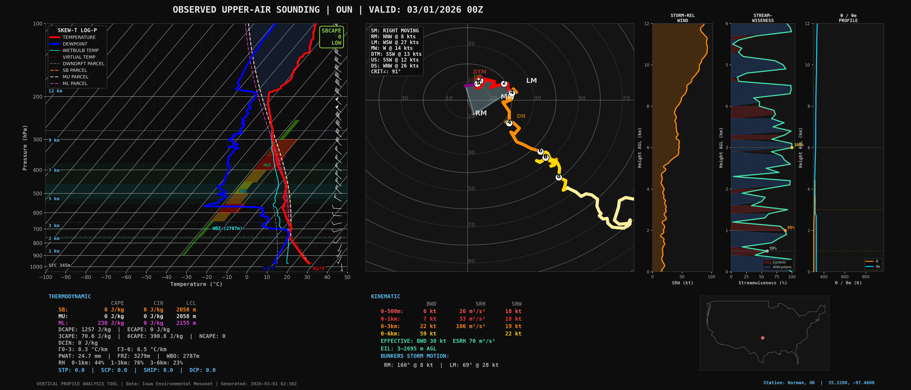
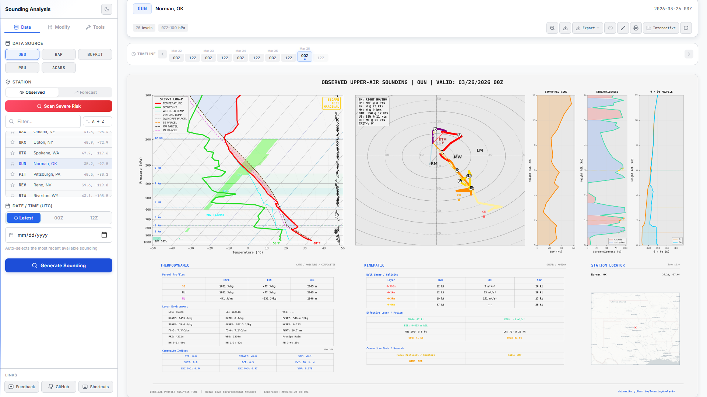
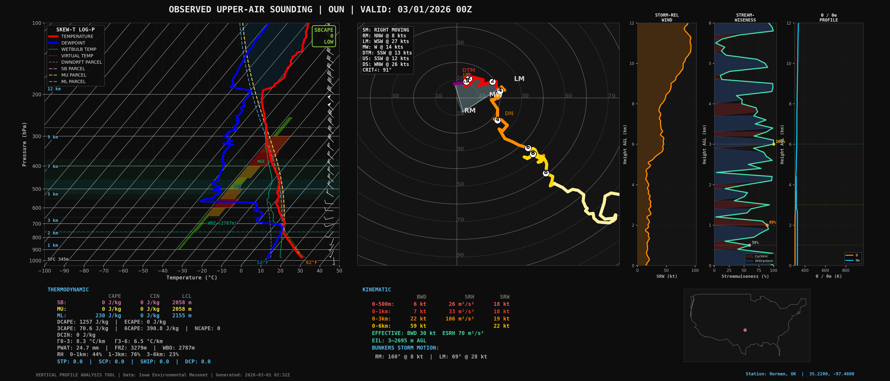

# Sounding Analysis Tool

[](https://github.com/ShianMike/SoundingAnalysis/commits/main)
[](https://github.com/ShianMike/SoundingAnalysis/stargazers)
[](https://github.com/ShianMike/SoundingAnalysis/forks)
[](https://www.python.org/)
[](https://react.dev/)
[](https://soundinganalysis-752306366750.asia-southeast1.run.app)
[](https://shianmike.github.io/SoundingAnalysis/)
[](#license)
[](https://unidata.github.io/MetPy/)

A full-stack atmospheric sounding analysis application that fetches real upper-air data from multiple sources and produces comprehensive Skew-T / Hodograph analysis plots — similar to [SounderPy](https://github.com/kylejgillett/sounderpy).

**Live site:** <https://shianmike.github.io/SoundingAnalysis/>

---

## Screenshots

### Example Sounding — Dark Theme (Default)
Full Skew-T Log-P diagram with hodograph, storm-relative wind/vorticity profiles, theta/theta-e panel, and computed parameters for OUN (Norman, OK):



### Light Theme
The same sounding rendered in light mode — toggle via the sidebar:



### Color-Blind Mode
Okabe-Ito / Wong 2011 color-safe palette for all plot traces:



---

## Features

### Skew-T Log-P Diagram
- **Temperature** & **Dewpoint** profiles
- **Wet-bulb temperature** trace
- **Virtual temperature** trace
- **SB / MU / ML parcel traces** with color-coded dashed lines
- **Downdraft (DCAPE) parcel** trace
- **CAPE/CIN shading** — red fill (CAPE) and blue fill (CIN) between SB parcel and environment
- Dry adiabats, moist adiabats, mixing ratio lines
- **0°C and -20°C highlighted isotherms**
- **Dendritic Growth Zone (DGZ)** shading (-12°C to -17°C)
- **Hail Growth Zone (HGZ)** shading (-10°C to -30°C)
- **PBL top** marker (mixed-layer depth)
- **OBS wind barbs** column (right edge)
- **VAD wind barbs** column (green, alongside OBS) — NEXRAD radar-derived winds plotted directly on the Skew-T for comparison
- Key level annotations (LCL, LFC, EL, Freezing level, WBZ)
- **Surface T/Td in °F** labels
- Height labels in km AGL

### Hodograph
- Color-coded by height (0–1, 1–3, 3–6, 6–9, 9–12 km layers)
- Bunkers right-mover, left-mover, and mean wind vectors
- Deviant Tornado Motion (DTM) marker
- Upshear / Downshear MCS motion markers
- **Critical angle** between 0–500m shear and storm-relative inflow
- VAD Wind Profiler overlay (green)
- Effective inflow layer SRH fill
- Dynamic bounds based on wind profile
- **Storm-relative mode** — toggle to shift all winds into the storm-relative frame (SM → origin crosshair)
- **Profile smoothing** — Gaussian filter (adjustable σ) to tame noisy ACARS profiles

### Computed Parameters
| Category | Parameters |
|---|---|
| **Thermodynamic** | SB/ML/MU CAPE & CIN, DCAPE, LCL height, LFC, EL, Lapse rates (0–3 km, 3–6 km), Precipitable water, Freezing level, Wet-bulb zero height, RH by layer |
| **Kinematic** | Bulk wind difference (500 m, 1 km, 3 km, 6 km), Storm-relative helicity (500 m, 1 km, 3 km), Storm-relative wind by layer, Bunkers storm motion, Critical angle |
| **Composite** | Significant Tornado Parameter (STP), Supercell Composite Parameter (SCP), Significant Hail Parameter (SHIP), Derecho Composite Parameter (DCP) |

### Additional Panels
- Storm-relative wind & streamwise vorticity profiles
- **Theta (θ) / Theta-e (θe) profile** — potential temperature and equivalent potential temperature vs height, with moisture gap fill and key height markers
- Comprehensive parameter text readout (thermodynamic + kinematic indices)

### VAD Wind Profile (VWP) Time-Height Display
- Standalone VWP panel showing wind barbs across time and height
- Fetches NEXRAD Level-III VAD data from Iowa Environmental Mesonet
- Configurable time range (up to 24 hours)
- Dark-themed time-height section with color-coded wind speed
- Toggle via toolbar button in the control panel

### Risk Scanner
- Scans all CONUS upper-air stations in parallel
- Scores sites by STP, SCP, SHIP, DCP / tornado potential
- Returns ranked results via API
- Auto-opens interactive station map with color-coded risk markers

### Interactive Station Map
- Dark-themed Leaflet map centered on CONUS
- Station markers color-coded by risk scan data (STP thresholds)
- Click station markers to select them
- Click anywhere on map to set lat/lon for RAP source
- Fly-to animation on station selection

### NEXRAD Radar & Velocity Overlays
- **Radar** toggle: NEXRAD base reflectivity mosaic (n0q) from IEM
- **Velocity** toggle: NEXRAD storm-relative velocity (N0U) from the nearest WSR-88D site
- Mutually exclusive — only one overlay active at a time
- Auto-selects nearest NEXRAD radar as you pan the map; shows active radar ID badge
- ~130 CONUS NEXRAD sites in the lookup table

### SPC Convective Outlook Overlay
- Day 1, Day 2, and Day 3 outlook overlays on the station map
- Fetches live GeoJSON from SPC
- Color-coded risk categories (General Thunder, Marginal, Slight, Enhanced, Moderate, High)
- Legend with risk percentages (tornado, severe, wind)
- Non-blocking overlays — station markers remain clickable through outlook polygons

### Sounding History
- Automatically saves last 20 soundings to localStorage
- Quick-load previous soundings with one click
- Relative timestamps ("3m ago", "2h ago")
- Tabbed view: **Soundings** and **Comparisons** tabs

### Favorite Stations
- Star icon to pin frequently used stations
- Persisted in localStorage
- Sort stations by favorites

### Dashboard Sidebar Layout
- Fixed left sidebar with branding, controls, and grouped sections
- Sidebar includes data source selection, station picker, date/time controls
- **Modifications** group: Surface Mod, Custom Storm Motion, VAD Wind Profile, SR Hodograph, Profile Smoothing
- **Tools** group: Map, Risk, Trends, Compare, VWP, History in a compact 3-column grid
- Settings row: Light/Dark theme toggle, Color-Blind Mode, Custom Upload
- Footer with Feedback and GitHub links
- History panel slides in beside the sidebar without overlapping content
- Responsive: collapses to stacked layout on mobile (≤1024px)

### Feedback & Suggestions
- Built-in feedback modal (Suggestion / Bug Report / Feature Request)
- Submitted to backend API for developer review
- Feedback logged to Cloud Run stdout for persistence across ephemeral containers

### Parameter Time-Series Charts
- Plot CAPE, SRH, STP, shear, lapse rates over a date range
- Date range picker (up to 14 days)
- 00Z + 12Z resolution for ≤7 days, 12Z only for >7 days
- Grouped parameter selector with exclusive group selection
- Custom dark-themed Recharts line charts with tooltips

### Multi-Sounding Comparison
- Compare up to 4 soundings side-by-side
- Slot-based UI: pick station, source, and date for each sounding
- Side-by-side Skew-T plots in a responsive grid
- Full parameter comparison table with Δ (difference) column
- Highlights highest/lowest values across soundings
- 00Z/12Z toggle for observed/ACARS sources
- **Download comparison** — Tiles all sounding plots into a single composite PNG
- **Comparison history** — Automatically saved to localStorage; reload previous comparisons from the History panel's "Comparisons" tab

### Shareable Sounding Links
- Sounding parameters encoded in the URL query string
- Opening a link auto-fetches the sounding (station, source, date, model, etc.)
- "Copy Link" button in the results toolbar
- Great for sharing specific soundings with colleagues

### Export Formats
- **CSV** — All computed parameters in spreadsheet-ready format
- **SHARPpy** — Raw profile data in SHARPpy-compatible format for further analysis
- **CM1** — `input_sounding` format for Cloud Model 1 numerical simulations
- All exports available as one-click downloads from the results toolbar

---

## Data Sources

| Source | Flag | Description |
|---|---|---|
| **Observed (IEM/UWyo)** | `--source obs` | Real radiosonde observations from CONUS upper-air sites |
| **RAP Analysis** | `--source rap` | Rapid Refresh model analysis at any lat/lon (requires `siphon`) |
| **BUFKIT Forecasts** | `--source bufkit` | HRRR, RAP, NAM, NAM-Nest, GFS, SREF forecasts from Iowa State |
| **ACARS/AMDAR** | `--source acars` | Aircraft observations at airports (IEM) |

---

## Project Structure

```
├── sounding.py          # Core: data fetching, parameter computation, plotting
├── app.py               # Flask API serving the React frontend
├── Dockerfile           # Docker config for Cloud Run deployment
├── gunicorn.conf.py     # Gunicorn config (reads PORT from env)
├── requirements.txt     # Python dependencies
├── deploy.ps1           # Build frontend + deploy to GitHub Pages
├── deploy-cloudrun.ps1  # Deploy backend to Google Cloud Run
├── .gcloudignore        # Exclude frontend from Cloud Build uploads
├── feedback.json        # Server-side feedback storage
└── frontend/            # React + Vite frontend
    ├── src/
    │   ├── App.jsx              # Main app shell
    │   ├── api.js               # API client with timeouts & retries
    │   ├── history.js           # localStorage sounding history
    │   ├── favorites.js         # localStorage station favorites
    │   └── components/
    │       ├── ControlPanel.jsx   # Dashboard sidebar: branding, controls, footer
    │       ├── Header.jsx         # Feedback modal (portal)
    │       ├── ResultsView.jsx    # Plot image + parameter display + map
    │       ├── StationMap.jsx     # Interactive Leaflet station map
    │       ├── HistoryPanel.jsx   # Sounding history sidebar
    │       ├── TimeSeriesChart.jsx # Recharts time-series parameter charts
    │       ├── ComparisonView.jsx  # Multi-sounding comparison view
    │       ├── VwpDisplay.jsx     # VAD Wind Profile time-height display
    │       └── *.css              # Component styles (dark theme)
    ├── public/
    │   └── favicon.svg          # Custom skew-T favicon
    ├── package.json
    └── vite.config.js
```

---

## Quick Start

### Backend (Python)

```bash
# Install dependencies
pip install -r requirements.txt

# Optional for RAP source:
pip install siphon

```

**CLI usage (standalone):**

```bash
python sounding.py                                            # Interactive menu
python sounding.py --station OUN                              # Latest observed
python sounding.py --station OUN --date 2024061200            # Specific date/time
python sounding.py --source rap --lat 36.4 --lon -99.4        # RAP at any point
python sounding.py --source bufkit --model hrrr --station OUN # HRRR forecast
python sounding.py --source acars --station KDFW              # Aircraft obs
python sounding.py --list-sources                             # Show all sources
```

**API server:**

```bash
python app.py
# → http://localhost:5000
```

### Frontend (React)

```bash
cd frontend
npm install
npm run dev
# → http://localhost:5173
```

Set `VITE_API_URL` to point to your backend (defaults to localhost:5000).

---

## Deployment

| Component | Platform | URL |
|---|---|---|
| **Backend API** | Google Cloud Run | `https://soundinganalysis-752306366750.asia-southeast1.run.app` |
| **Frontend** | GitHub Pages | `https://shianmike.github.io/SoundingAnalysis/` |

To redeploy frontend:

```powershell
.\deploy.ps1
```

To redeploy backend:

```powershell
.\deploy-cloudrun.ps1
```

The frontend build uses Vite and force-pushes to the `gh-pages` branch.  
The backend deploys via Cloud Build from source to Cloud Run (Singapore region).

---

## API Endpoints

| Method | Endpoint | Description |
|---|---|---|
| `GET` | `/api/stations` | List all known sounding stations |
| `GET` | `/api/sources` | List available data sources and BUFKIT models |
| `POST` | `/api/sounding` | Fetch sounding, compute params, return base64 plot + data |
| `POST` | `/api/risk-scan` | Scan stations and return tornado risk scores |
| `POST` | `/api/time-series` | Fetch parameter trends over a date range |
| `POST` | `/api/compare` | Fetch multiple soundings for side-by-side comparison |
| `POST` | `/api/feedback` | Submit user feedback/suggestion |
| `GET`  | `/api/feedback` | Retrieve all submitted feedback |
| `GET`  | `/api/vwp-display` | Fetch VAD Wind Profile time-height display image |

### `POST /api/sounding` — Request Body

```json
{
  "source": "obs",
  "station": "OUN",
  "date": "2024061200",
  "lat": 35.22,
  "lon": -97.46,
  "model": "hrrr",
  "fhour": 0
}
```

---

## Dependencies

- **Python:** Flask, MetPy, Matplotlib, NumPy, Requests
- **Frontend:** React 18, Vite, Lucide React, Leaflet, React-Leaflet, Recharts
- **Optional:** siphon (RAP)

---

## Feature Comparison: Ours vs SounderPy (Gillett)

A side-by-side look at what our Sounding Analysis Tool offers compared to [SounderPy](https://github.com/kylejgillett/sounderpy) (v3.1.0) by Kyle J. Gillett.

### Data Sources

| Capability | Ours | SounderPy |
|---|:---:|:---:|
| Observed radiosondes (UWyo / IEM) | ✅ | ✅ |
| RAP model analysis (THREDDS) | ✅ | ✅ |
| BUFKIT forecast models (ISU + PSU) | ✅ (ISU) | ✅ (ISU + PSU) |
| ERA5 global reanalysis (CDS) | ❌ | ✅ |
| ACARS aircraft observations | ✅ (IEM) | ✅ (OU archive) |
| RUC reanalysis (2005–2020) | ❌ | ✅ |
| NCEP-FNL reanalysis | ❌ | ✅ |
| IGRAv2 global obs archive (1905–present) | ❌ | ✅ |
| WRF output ingestion | ❌ | ✅ |
| CM1 input_sounding ingestion | ❌ | ✅ |
| Custom user-defined data dict | ❌ | ✅ |
| Omega / vertical velocity (model data) | ❌ | ✅ |

### Plotting & Visualization

| Capability | Ours | SounderPy |
|---|:---:|:---:|
| Skew-T Log-P diagram | ✅ | ✅ |
| Hodograph (color-coded by height) | ✅ | ✅ |
| Dark mode | ✅ (default) | ✅ (optional) |
| Light mode | ✅ (toggle) | ✅ (default) |
| Color-blind mode | ✅ (toggle) | ✅ |
| Wet-bulb temperature trace | ✅ | ✅ |
| Virtual temperature trace | ✅ | ✅ |
| Downdraft (DCAPE) parcel trace | ✅ | ❌ |
| Wind barbs on Skew-T | ✅ | ✅ |
| Key level annotations (LCL, LFC, EL) | ✅ | ✅ |
| Height labels (km AGL) | ✅ | ✅ |
| Radar reflectivity overlay (mosaic / single-site) | ✅ (IEM mosaic) | ✅ |
| Radar velocity overlay (storm-relative) | ✅ (RIDGE N0U) | ❌ |
| Map inset with station location | ✅ (CONUS outline) | ✅ (with radar) |
| Map inset zoom control | ❌ | ✅ |
| Storm-relative wind profile panel | ✅ | ✅ |
| Streamwise vorticity / streamwiseness panel | ✅ | ✅ |
| Piecewise CAPE / stepwise CAPE-CIN plot | ❌ | ✅ |
| Theta / Theta-e profile panel | ✅ | ✅ |
| Hodograph boundary lines | ❌ | ✅ |
| Composite sounding (overlay multiple profiles) | ❌ | ✅ |
| VAD (radar wind profiler) hodograph | ✅ | ✅ |
| VAD barbs on Skew-T (dual OBS/VAD columns) | ✅ | ✅ |
| VWP time-height display (standalone panel) | ✅ | ✅ |
| Storm-relative hodograph mode | ✅ | ✅ |

### Parcel & Parameter Calculations

| Capability | Ours | SounderPy |
|---|:---:|:---:|
| SB / MU / ML CAPE & CIN | ✅ | ✅ |
| DCAPE | ✅ | ✅ |
| ECAPE (entraining CAPE) | ✅ | ✅ |
| Irreversible adiabatic ascent parcels | ❌ | ✅ |
| Pseudoadiabatic ascent parcels | ✅ (implicit) | ✅ (explicit) |
| STP, SCP, SHIP, DCP composites | ✅ | ✅ (via SHARPpy) |
| SRH (500 m, 1 km, 3 km) | ✅ | ✅ |
| Bulk wind difference (shear layers) | ✅ | ✅ |
| Bunkers storm motion (RM, LM, MW) | ✅ | ✅ |
| Custom storm motion input | ✅ | ✅ |
| Surface modification (override sfc T/Td/wind) | ✅ | ✅ |
| Lapse rates (0–3, 3–6 km) | ✅ | ✅ |
| Precipitable water, freezing level, WBZ | ✅ | ✅ |
| RH by layer | ✅ | ✅ |

### Helper & Utility Tools

| Capability | Ours | SounderPy |
|---|:---:|:---:|
| Export to CSV | ✅ | ✅ |
| Export to CM1 format | ✅ | ✅ |
| Export to SHARPpy format | ✅ | ✅ |
| Profile merging (weighted average) | ❌ | ✅ |
| Profile smoothing (Gaussian) | ✅ | ✅ |
| Vertical interpolation utility | ✅ (internal, 100 m) | ✅ (exposed API) |
| Print variables to console | ✅ (CLI) | ✅ |
| Find nearest station | ✅ | ✅ |
| Lat/lon lookup by station type | ❌ | ✅ |

### Web Application Features (Ours Only)

These are features that exist in our web app but have **no equivalent in SounderPy** (which is a Python library, not a web app):

| Feature | Description |
|---|---|
| **Full-stack web app** | React frontend + Flask API, deployed on GitHub Pages + Cloud Run |
| **Interactive station map** | Dark Leaflet map with click-to-select stations & lat/lon picking |
| **SPC outlook overlays** | Day 1/2/3 convective outlook GeoJSON on the map |
| **NEXRAD radar + velocity** | Reflectivity mosaic & per-site storm-relative velocity toggles |
| **Risk scanner** | Parallel CONUS-wide scan ranking stations by STP/SCP/SHIP/DCP |
| **Multi-sounding comparison** | Up to 4 side-by-side Skew-T plots with parameter diff table |
| **Parameter time-series charts** | Plot CAPE, SRH, STP, shear over a date range (up to 14 days) |
| **Sounding history** | Auto-saved last 20 soundings in localStorage, one-click reload |
| **Favorite stations** | Pinned stations persisted in localStorage |
| **Comparison history** | Auto-saved comparisons with reload from History panel |
| **Feedback system** | In-app bug report / feature request modal |
| **Download comparison PNG** | Tiles all compared sounding plots into a single image |
| **VWP time-height display** | Standalone panel showing wind barbs across time and height from NEXRAD VAD data |
| **Shareable sounding links** | URL-encoded sounding parameters for direct sharing; auto-fetches on link open |
| **SHARPpy / CM1 export** | One-click download of raw profile data in SHARPpy and CM1 input_sounding formats |
| **Light / Dark theme** | Toggle between dark and light themes with localStorage persistence |
| **Color-blind mode** | Okabe-Ito/Wong 2011 color-safe palette for all plot traces |
| **Custom data upload** | Upload CSV, SHARPpy, or CM1 sounding data for full analysis |

---

## Upcoming Features

### High Priority — Parity with SounderPy

- [x] **ECAPE (Entraining CAPE)** — Entraining CAPE calculations using the Peters et al. (2023) formulation; displayed on Skew-T and in parameter tables ✅
- [x] **Radar Reflectivity & Velocity Overlays** — NEXRAD mosaic reflectivity + per-site storm-relative velocity (N0U) toggles on the station map ✅
- [x] **Composite Sounding Overlay** — Overlay multiple T/Td profiles + hodographs on a single Skew-T via the Comparison panel ✅
- [x] **Surface Modification** — Override surface T, Td, wind speed/direction and re-compute all parameters ✅
- [x] **Custom Storm Motion** — Input custom storm motion (direction + speed) for SRH/SRW recalculation ✅
- [x] **Piecewise CAPE / Stepwise CAPE-CIN** — Layer-by-layer CAPE/CIN data computed and returned via API ✅
- [x] **CAPE/CIN Shading** — Red/blue fill between SB parcel trace and environment temperature on Skew-T ✅
- [x] **DGZ / HGZ Shading** — Dendritic Growth Zone (-12°C to -17°C) and Hail Growth Zone (-10°C to -30°C) horizontal bands ✅
- [x] **PBL Top Marker** — Mixed-layer depth annotated on the Skew-T diagram ✅
- [x] **Critical Angle** — Angle between 0-500m shear vector and storm-relative inflow displayed in hodograph SM info box ✅
- [x] **Effective SRH / Effective BWD** — SRH and shear computed for the effective inflow layer (Thompson et al. 2007) ✅
- [x] **3CAPE / 6CAPE** — 0-3 km and 0-6 km CAPE per parcel type ✅
- [x] **DCIN (Downdraft CIN)** — Measures capping strength below the downdraft ✅
- [x] **MU NCAPE** — Normalized CAPE (CAPE / EL-LFC depth) for buoyancy intensity ✅
- [x] **Piecewise CAPE Bars** — Visualize the computed piecewise CAPE as colored bars on the Skew-T ✅
- [x] **Color-Coded CAPE Badge** — Large colored CAPE magnitude indicator scaled to severity ✅

### Medium Priority — New Capabilities

- [x] **Export Parameters to CSV** — One-click CSV download of all computed thermodynamic, kinematic, and moisture parameters ✅
- [x] **Export to SHARPpy / CM1 Format** — Save sounding data in formats compatible with SHARPpy and CM1 ✅
- [x] **Profile Merging** — Weighted-average two soundings together to create a blended analysis profile
- [x] **Profile Smoothing** — Apply Gaussian smoothing to noisy profiles (especially ACARS); adjustable sigma parameter ✅
- [x] **VAD Wind Profiler Hodograph** — Fetch and plot NEXRAD VAD (Velocity Azimuth Display) wind data on the hodograph ✅
- [x] **VAD Barbs on Skew-T** — Dual OBS/VAD barb columns on the Skew-T for direct wind comparison ✅
- [x] **VWP Time-Height Display** — Standalone panel showing NEXRAD VAD wind barbs across time and height ✅
- [x] **Storm-Relative Hodograph Mode** — Toggle the hodograph between ground-relative and storm-relative frames; SM at origin with crosshair marker ✅
- [x] **Hodograph Boundary Lines** — Draw user-defined boundary lines on the hodograph at custom angles
- [x] **Color-Blind Mode** — Okabe-Ito/Wong 2011 color-safe palette for all plot traces; toggle in sidebar ✅
- [x] **Light Theme Toggle** — Toggle between dark and light themes with localStorage persistence ✅
- [x] **Theta / Theta-e Profile Panel** — Potential temperature (θ) and equivalent potential temperature (θe) profiles plotted vs height with moisture gap fill ✅

### Lower Priority — Quality of Life

- [ ] **Custom Station Groups** — Create and save named groups of stations for quick batch analysis
- [ ] **WRF / CM1 Data Ingestion** — Allow uploading WRF output or CM1 input_sounding files for analysis
- [x] **Custom Data Upload** — Upload CSV, SHARPpy, or CM1 sounding data for full analysis with auto-format detection ✅
- [ ] **PSU BUFKIT Feed** — Add Penn State's real-time BUFKIT feed as a secondary forecast model source
- [ ] **Map Inset Zoom Control** — Adjustable zoom level for the CONUS mini-map on sounding plots
- [ ] **Animated Time-Series Playback** — Step through time-series soundings as an animation
- [ ] **Mobile-Optimized Sounding View** — Pinch-zoom and swipe-friendly sounding plot rendering on mobile
- [x] **Shareable Sounding Links** — Encode station/source/date in URL for direct sharing; auto-fetch on link open; copy-link button ✅

---

## License

This project is for educational and research purposes.
