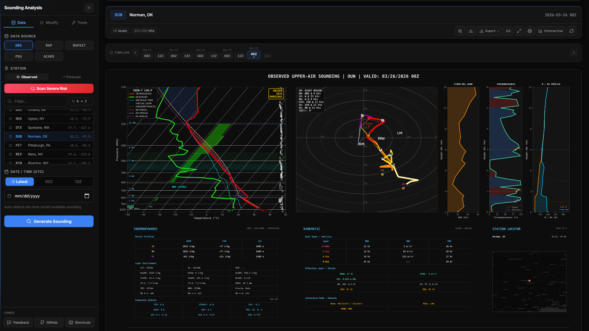
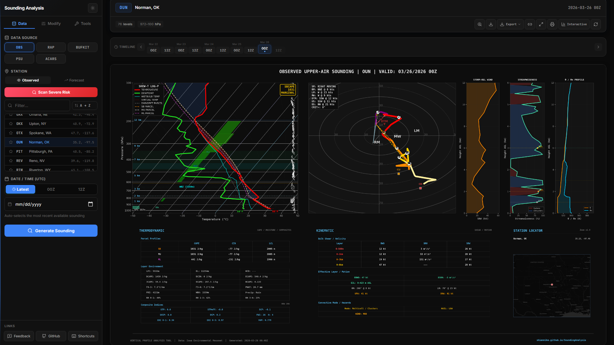
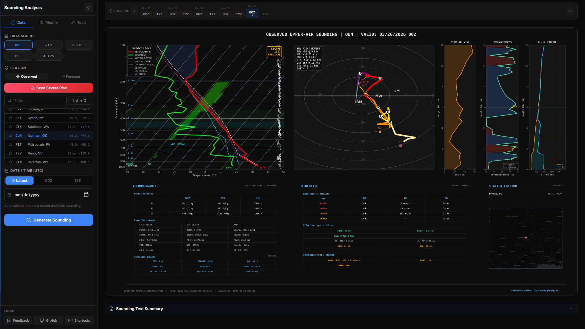
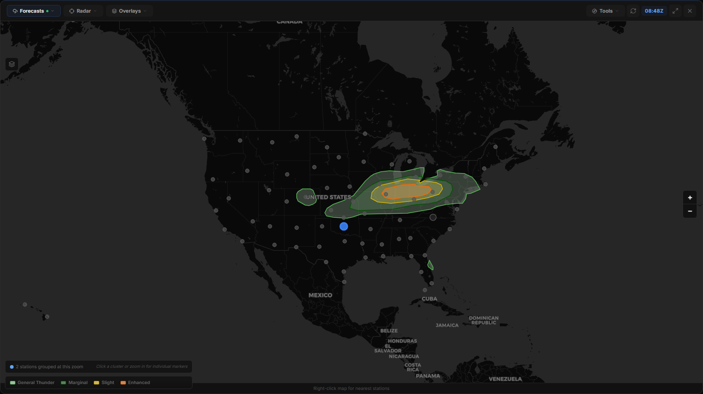
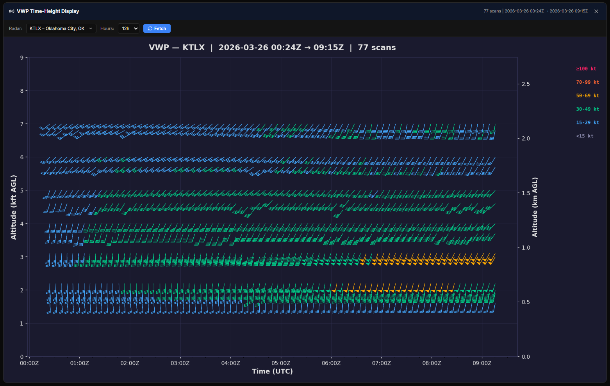
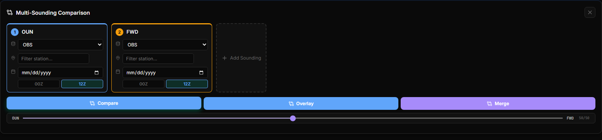
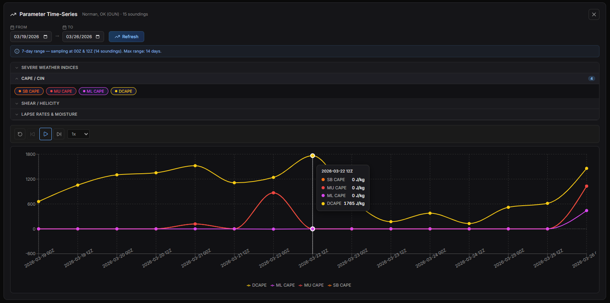
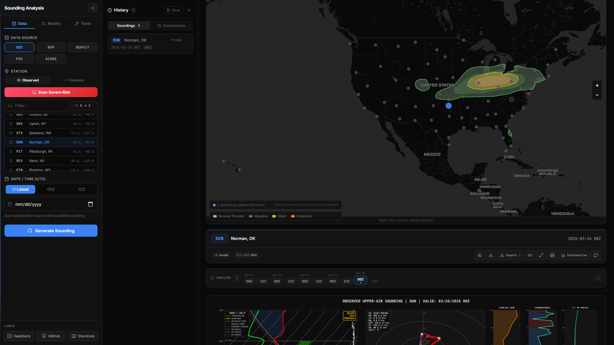
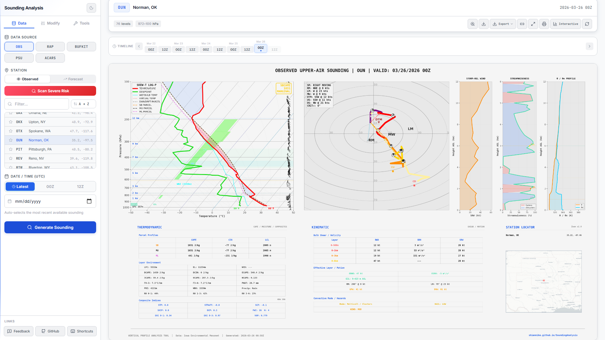

# Sounding Analysis Tool

[](https://github.com/ShianMike/SoundingAnalysis/commits/main)
[](https://github.com/ShianMike/SoundingAnalysis/stargazers)
[](https://github.com/ShianMike/SoundingAnalysis/forks)
[](https://www.python.org/)
[](https://react.dev/)
[](https://soundinganalysis-752306366750.asia-southeast1.run.app)
[](https://shianmike.github.io/SoundingAnalysis/)
[](#license)
[](https://unidata.github.io/MetPy/)

A full-stack atmospheric sounding analysis platform that fetches real upper-air data from six data sources, computes 50+ thermodynamic and kinematic parameters, and renders comprehensive Skew-T / Hodograph analysis with interactive overlays, live radar, and severe-weather risk scanning — all in a single Progressive Web App.

**Live site:** <https://shianmike.github.io/SoundingAnalysis/>

---

## Screenshots

### Dashboard
Sidebar control panel with data source selection, station picker, date/time controls, model/forecast hour selectors, surface modifications, and storm motion input. Results display on the right.



### Sounding Plot (Dark Theme)
Full Skew-T Log-P diagram with hodograph, storm-relative wind/vorticity profiles, theta/theta-e panel, Corfidi vectors, and computed parameters:



### Parameters & Climatology
Color-coded parameter cards with severity thresholds. Horizontal bar charts rank each parameter against SPC severe-weather proximity sounding climatology (grey < 50th, green 50th–75th, orange 75th–90th, red > 95th):



### Station Map with Radar, Warnings & Overlays
Interactive Leaflet map with station markers, animated composite + mosaic radar, storm-relative velocity, NWS active warnings, SPC Day 1–8 convective outlooks, watch boxes, mesoscale discussions, wind flow animation, lightning strikes, storm spotters, live chasers, and ACARS airport markers:



### VWP Time-Height Display
NEXRAD VAD wind barbs across time and height — searchable radar dropdown sorted by proximity, configurable time window (3–48 h):



### Multi-Sounding Comparison
Compare up to 4 soundings side-by-side with full Skew-T plots, a parameter comparison table with Δ column, profile merging, and composite overlay:



### Parameter Time-Series Charts
Plot CAPE, SRH, STP, shear, lapse rates, and more over a configurable date range (up to 14 days). Grouped parameter selector with dark-themed Recharts line charts:



### Sounding History
Auto-saved last 20 soundings with one-click reload. Tabbed view for soundings and comparisons with relative timestamps:



### Light Theme
Toggle between dark and light themes — fully consistent styling across all panels and plots:



### Color-Blind Mode
Okabe-Ito / Wong 2011 color-safe palette for all plot traces:


---

## Features

### Skew-T Log-P Diagram
- **Source-aware plot titles** — "OBSERVED UPPER-AIR SOUNDING", "HRRR FORECAST (INIT + FHOUR → VALID)", "RAP ANALYSIS", or "ACARS AIRCRAFT OBS" depending on data source
- **Temperature** & **Dewpoint** profiles with **wet-bulb** and **virtual temperature** traces
- **SB / MU / ML parcel traces** with color-coded dashed lines and **Downdraft (DCAPE) parcel** trace
- **CAPE/CIN shading** — red fill (CAPE) and blue fill (CIN) between SB parcel and environment
- Dry adiabats, moist adiabats, mixing ratio lines
- **0 °C and −20 °C highlighted isotherms**
- **Dendritic Growth Zone (DGZ)** shading (−12 °C to −17 °C) and **Hail Growth Zone (HGZ)** shading (−10 °C to −30 °C)
- **PBL top** marker (mixed-layer depth)
- **Piecewise CAPE bars** — color-coded layer-by-layer CAPE visualization
- **OBS wind barbs** column (right edge) with optional **VAD wind barbs** (green, alongside OBS)
- Key level annotations (LCL, LFC, EL, Freezing level, WBZ) and surface T/Td in °F
- Height labels in km AGL

### Hodograph
- Color-coded by height (0–1, 1–3, 3–6, 6–9, 9–12 km layers)
- Bunkers right-mover, left-mover, and mean wind vectors
- Deviant Tornado Motion (DTM) and Upshear / Downshear MCS motion markers
- **Corfidi Upwind / Downwind** vectors for MCS motion estimation
- **Critical angle** between 0–500 m shear and storm-relative inflow
- VAD Wind Profiler overlay (green) and Effective inflow layer SRH fill
- **Storm-relative mode** — shift all winds into the storm-relative frame (SM → origin crosshair)
- **Profile smoothing** — Gaussian filter (adjustable σ) for noisy ACARS profiles
- **Boundary line** — user-defined boundary orientation plotted on the hodograph

### Computed Parameters (50+)

| Category | Parameters |
|---|---|
| **Thermodynamic** | SB/ML/MU CAPE & CIN, DCAPE, DCIN, ECAPE, 3CAPE, 6CAPE, MU NCAPE, LCL height, LFC, EL, Lapse rates (0–3 km, 3–6 km), Precipitable water, Freezing level, Wet-bulb zero height, RH by layer |
| **Kinematic** | Bulk wind difference (500 m, 1 km, 3 km, 6 km), Effective BWD, Storm-relative helicity (500 m, 1 km, 3 km), Effective SRH, Storm-relative wind by layer, Bunkers storm motion, Critical angle, Corfidi Upwind / Downwind vectors |
| **Composite** | STP (fixed & effective), SCP, SHIP, DCP, BRN, ECAPE, NCAPE |
| **Hazard Assessment** | Tornado, Hail, Wind, Flood threat levels (HIGH / MOD / LOW / NONE) |
| **Convective Mode** | Predicted storm mode (Discrete Supercell → Multicell → Single Cell) via BRN + Thompson et al. 2007 |
| **Downburst** | WMSI, MDPI, Max Gust estimate |
| **Fire Weather** | Fosberg FWI, Haines Index, Hot-Dry-Windy Index |
| **Winter Wx** | Precip Type (Bourgouin 2000), Warm/Cold layer energy |
| **Temperature Advection** | WAA/CAA classification in 1 km layers (0–6 km) |

### Interactive Skew-T (D3 Canvas)
- Full interactive D3-based Skew-T Log-P diagram alongside the static Matplotlib plot
- Pan, zoom, and hover with real-time readout of T, Td, pressure, and height
- Parcel trajectory overlays with significant level markers (LCL, LFC, EL, Freezing Level, WBZ)
- Downloadable as PNG; syncs with dark/light theme toggle

### Interactive Hodograph (Canvas)
- Canvas-based hodograph with height-colored wind trace (0–1, 1–3, 3–6, 6–9, 9–12 km)
- Bunkers RM/LM/MW storm motion vectors with speed rings
- Hover readout showing wind speed, direction, height, and streamwiseness at cursor
- Storm-relative mode support; downloadable as PNG

### Sounding Animation
- Animate through BUFKIT forecast hours with play/pause/step controls
- Adjustable playback speed and timeline slider
- Skew-T, hodograph, and parameters update frame-by-frame

### Additional Panels
- Storm-relative wind & streamwise vorticity profiles
- **Theta (θ) / Theta-e (θe) profile** — potential temperature and equivalent potential temperature vs height, with moisture gap fill and key height markers
- **Three-panel parameter layout** — Thermodynamic (CAPE/moisture/composites), Kinematic (shear/helicity/motion), and Station Locator (CartoDB map tile with station marker)
- **Climatology percentile comparison** — horizontal bar chart ranking each parameter against SPC severe-weather proximity sounding climatology
- **Predicted Convective Mode** — visual spectrum bar (Pulse → Multicell → Supercell) with active-mode highlight
- **Hazard Assessment** — always displays all 4 threat types (Tornado, Hail, Wind, Flood) with level or NONE

### VAD Wind Profile (VWP) Time-Height Display
- Standalone VWP panel showing wind barbs across time and height
- **Searchable radar dropdown** with all ~120 NEXRAD sites, sorted by proximity to selected station, with distance in km
- Fetches NEXRAD Level-III VAD data from Iowa Environmental Mesonet
- Configurable time range (3 h, 6 h, 12 h, 24 h, 48 h)
- Dark-themed time-height section with color-coded wind speed

### Risk Scanner & Mesoscale Dashboard
- Scans all CONUS upper-air stations in parallel (ThreadPoolExecutor, configurable workers)
- **Observed mode** — scores sites using real radiosonde data (STP, SCP, SHIP, DCP)
- **Forecast mode** — scores sites using BUFKIT model sounding data (HRRR, RAP, NAM, NAM Nest, GFS)
  - Model selector with forecast hour range per model (HRRR 0–48 h, RAP 0–21 h, GFS 0–384 h, etc.)
  - Forecast hour slider with live UTC valid-time display (e.g., "F12 · 10 Mar 18Z")
  - Auto-selects latest available model init cycle with archive lag offset
- **Click-to-load** — click any station row to instantly load its full sounding (BUFKIT for forecast, OBS for observed)
- **Export PNG** — high-resolution (3× scale) PNG export of the top 15 stations with model/fhour metadata
- Auto-opens interactive station map with color-coded risk markers
- **Mesoscale panel:** sortable multi-station parameter table with color-coded threshold chips

### Interactive Station Map
- Dark-themed Leaflet map centered on CONUS with CartoDB dark_matter / positron tiles
- Station markers color-coded by risk scan data (STP thresholds)
- Click station markers to select them; click anywhere on map to set lat/lon for RAP source
- Fly-to animation on station selection

**Radar & Weather Overlays:**
- **Animated radar:** composite reflectivity (RainViewer) and IEM US mosaic (N0Q) with play/pause/step controls and frame scrubbing (24 frames, 2-hour window)
- **Velocity overlay:** storm-relative velocity from nearest WSR-88D with dynamic product detection (prefers N0U, falls back to N0S), color legend, radar site marker, 230 km range ring, and IEM scan timestamp
- **NWS active warnings:** real-time Tornado / Severe Thunderstorm / Flash Flood / Special Weather warnings rendered as color-coded polygons with click-for-details popups
- **SPC outlook overlays:** Day 1 through Day 8 convective outlook GeoJSON with color-coded risk categories and legend
- **SPC watch boxes:** Tornado and Severe Thunderstorm watch outlines from NWS MapServer
- **SPC mesoscale discussions:** active MD polygons on the map
- **Custom Outlook overlay:** formula-based severe-weather outlook with categorical and probabilistic (Tornado/Wind/Hail) GeoJSON polygons, generated from latest observed radiosonde data
- **Wind flow animation:** surface streamlines and 500 hPa steering flow from Open-Meteo, rendered on a Canvas layer with animated particle trails
- **Wind barbs on map:** toggle surface / 850 hPa / 500 hPa Open-Meteo wind barbs
- **Lightning overlay:** real-time lightning strikes via Blitzortung WebSocket feed
- **Spotter Network:** real-time active storm spotter positions
- **Live Storm Chasers:** real-time chaser positions and HLS video streams via LiveStormChasing API

**Map Tools:**
- **Draw Storm Motion:** two-click tool to define a custom storm-motion vector with live speed (kt) and direction readout; auto-fills ControlPanel fields
- **Draw Boundary:** two-click tool to define a boundary orientation line with live angle preview; auto-fills ControlPanel boundary orientation
- **Shear vectors:** 0–6 km bulk shear direction arrows on station markers (requires risk scan)
- **Proximity search:** "Near me" button finds the closest upper-air stations to your browser location
- **Favorite station stars:** gold star markers highlight pinned stations
- **ACARS airport markers:** blue aircraft icons on 60+ major ACARS-capable airports with click-to-fetch

### Multi-Sounding Comparison
- Compare up to 4 soundings side-by-side
- Slot-based UI: pick station, source, and date for each sounding
- Side-by-side Skew-T plots in a responsive grid
- Full parameter comparison table with Δ (difference) column; highlights extremes
- **Profile merging** — weighted-average blend of two profiles
- **Composite overlay** — multiple profiles on a single Skew-T
- **Download comparison** — tiles all plots into a single composite PNG
- **Comparison history** — auto-saved to localStorage; reload from History panel

### Parameter Time-Series Charts
- Plot CAPE, SRH, STP, shear, lapse rates over a date range (up to 14 days)
- 00Z + 12Z resolution for ≤ 7 days, 12Z only for > 7 days
- Grouped parameter selector with exclusive group selection
- Custom dark-themed Recharts line charts with tooltips

### Custom Severe-Weather Outlook
- **Formula-based outlook generation** — scans all 73 CONUS upper-air stations using latest observed radiosonde data
- Computes STP, SCP, SHIP, DCP, CAPE, SRH, and 0–6 km BWD for each station via MetPy
- **Categorical risk classification** (TSTM → MRGL → SLGT → ENH → MDT → HIGH) using custom composite thresholds
- **Probabilistic hazard layers** — Tornado (2%/5%/10%/30%), Wind (5%/15%/30%), Hail (5%/15%/30%)
- GeoJSON polygons via Shapely convex hull with graduated buffer sizes per risk level for natural nesting
- **Type selector** — toggle between Categorical, Tornado, Wind, and Hail views
- **In-memory caching** — 10-minute cache per sounding cycle; instant on refresh within the same 00Z/12Z window
- 20 parallel workers for fast I/O-bound station scanning (~20–40 s first load)
- Mutually exclusive with SPC Outlook overlay; legend updates dynamically per hazard type
- SPC-style color scheme matching real SPC outlook categories and probability contours

### Ensemble Sounding Plume
- Spaghetti plume by fetching multiple BUFKIT forecast hours
- T/Td traces at adjustable alpha for spread visualization
- Hodograph spread panel showing low-level wind variability
- Configurable hour presets: short (0–6 h), medium (0–12 h), long (0–24 h), extended (0–48 h)
- Supports both Iowa State archive and Penn State real-time feeds with auto-fallback

### Live Storm Chasing Panel
- Real-time storm chaser positions from the LiveStormChasing API
- HLS video stream playback (hls.js) for active chaser feeds
- Click chaser markers on the map to open their live stream

### Sounding Modifications
- **Surface modification** — override surface T, Td, wind speed/direction and re-compute all parameters
- **Custom storm motion** — input direction + speed for SRH/SRW recalculation; also settable by drawing on the station map
- **Profile smoothing** — Gaussian filter with adjustable σ (great for noisy ACARS profiles)
- **Boundary orientation** — plot boundary line on hodograph at custom angle; also settable by drawing on the station map

### Sounding History & Favorites
- Auto-saves last 20 soundings to localStorage with one-click reload
- Relative timestamps ("3m ago", "2h ago")
- Tabbed view: Soundings and Comparisons tabs
- **Favorite stations** — pin frequently used stations; persisted in localStorage

### Sounding Timeline
- Horizontal scrollable bar showing available sounding times for the past 4 days
- 00Z and 12Z cycle buttons with one-click fetch
- Displayed above the results when a sounding is loaded

### Shareable Sounding Links
- Sounding parameters encoded in the URL query string
- Opening a link auto-fetches the sounding (station, source, date, model, etc.)
- "Copy Link" button in the results toolbar

### Export Formats
- **CSV** — all computed parameters in spreadsheet-ready format
- **JSON** — full sounding data and parameters in JSON format
- **SHARPpy** — raw profile data in SHARPpy-compatible format
- **CM1** — `input_sounding` format for Cloud Model 1 numerical simulations
- **Comparison CSV** — side-by-side parameter comparison export
- All exports available as one-click downloads from the results toolbar

### WRF / CM1 Data Ingestion
- Upload WRF netCDF output files (wrfout_d0x) directly from the Custom Upload page
- Automatic grid point extraction — specify target lat/lon or use domain center
- Supports WRF staggered grids: P/PB, PH/PHB, T (perturbation theta), QVAPOR, U/V
- Also accepts text-based formats: CSV, SHARPpy, CM1 input_sounding

### PSU BUFKIT Feed (Penn State)
- Real-time BUFKIT profiles from Penn State's e-wall server
- Latest model run (RAP, HRRR, NAM, NAM Nest, GFS, HiResW, SREF)
- Complementary to age-indexed Iowa State archive
- Separate "PSU" data source option in the control panel

### Auto-Refresh & Parameter Alerts
- **Auto-refresh polling** — configurable interval to re-fetch sounding data automatically
- **Parameter watch alerts** — highlight cards that changed since the last fetch with a yellow pulse animation

### PWA / Offline Support
- Installable as a Progressive Web App (manifest + service worker)
- Caches static assets for offline access to previously loaded data

### Theme & Accessibility
- **Dark theme** (default) and **Light theme** toggle with localStorage persistence
- **Color-blind mode** — Okabe-Ito / Wong 2011 color-safe palette
- **Keyboard shortcuts** — H = history, C = compare, M = map, T = trends, V = VWP, ? = help
- **Print layout** — optimized `@media print` stylesheet with 4-column compact parameter grid
- **Mobile-responsive** — breakpoints at 1024 px, 768 px, 480 px; touch-friendly drag-to-pan on plots
- **Skew-T theme sync** — interactive Canvas plots automatically match dark/light mode

### Feedback System
- Built-in modal for Suggestion / Bug Report / Feature Request
- Submitted to backend API; logged to Cloud Run stdout

---

## Data Sources

| Source | Flag | Description |
|---|---|---|
| **Observed (IEM/UWyo)** | `--source obs` | Real radiosonde observations from CONUS upper-air sites |
| **RAP Analysis** | `--source rap` | Rapid Refresh model analysis at any lat/lon |
| **BUFKIT Forecasts** | `--source bufkit` | HRRR, RAP, NAM, NAM-Nest, GFS, SREF forecasts from Iowa State |
| **ACARS/AMDAR** | `--source acars` | Aircraft observations at 60+ major airports (IEM) |
| **PSU BUFKIT** | `--source psu` | Latest model run from Penn State's real-time feed (RAP, HRRR, NAM, GFS, etc.) |
| **Custom Upload** | (UI only) | Paste CSV/SHARPpy/CM1 text or upload WRF netCDF files |

---

## Project Structure

```
├── app.py                 # Flask entry point (blueprints, Talisman, CORS, rate limits, SPA catch-all)
├── gunicorn.conf.py       # Gunicorn WSGI config (reads PORT from env)
├── requirements.txt       # Python dependencies
├── Dockerfile             # Container image for Cloud Run
├── deploy.ps1             # Build frontend → deploy to GitHub Pages
├── deploy-cloudrun.ps1    # Deploy backend to Google Cloud Run
├── setup-cloud-armor.ps1  # Optional Cloud Armor WAF setup
├── routes/                # Flask API route blueprints
│   ├── __init__.py          # Auto-registers all blueprints
│   ├── sounding_routes.py   # /api/sounding, /api/custom-sounding, /api/upload-file
│   ├── analysis.py          # /api/compare, /api/composite, /api/merge-profiles,
│   │                        #   /api/time-series, /api/ensemble-plume, /api/forecast-profiles
│   ├── risk.py              # /api/risk-scan, /api/forecast-risk-scan
│   ├── outlook.py           # /api/outlook (custom severe-weather outlook generation)
│   ├── wind.py              # /api/vad, /api/vwp-display, /api/wind-field
│   ├── spc.py               # /api/spc-outlook, /api/spc-discussion, /api/spc-outlook-stations
│   ├── meta.py              # /api/health, /api/stations, /api/sources, /api/acars-airports
│   ├── feedback.py          # /api/feedback (GET/POST)
│   └── helpers.py           # Shared utilities (safe_round, parse_date, etc.)
├── sounding/              # Core analysis package
│   ├── __init__.py          # Public API exports
│   ├── __main__.py          # CLI entry (python -m sounding)
│   ├── cli.py               # Interactive CLI menu
│   ├── constants.py         # Station database, BUFKIT model metadata
│   ├── fetchers.py          # Data fetchers (OBS, RAP, BUFKIT, PSU, ACARS)
│   ├── parameters.py        # 50+ computed atmospheric parameters
│   ├── plotting.py          # Matplotlib Skew-T, hodograph, parameter panels
│   ├── tornado.py           # Risk scoring (STP/SCP/SHIP/DCP)
│   ├── merge.py             # Profile merging with weighted blending
│   ├── map_data.py          # Map-related data helpers
│   ├── utils.py             # Time / station utilities
│   └── vad.py               # VAD Wind Profile fetching & plotting
└── frontend/              # React 18 + Vite 6
    ├── src/
    │   ├── App.jsx              # Main app shell
    │   ├── api.js               # API client (timeouts, retries, base URL)
    │   ├── history.js           # localStorage sounding history
    │   ├── favorites.js         # localStorage station favorites
    │   └── components/
    │       ├── ControlPanel.jsx           # Sidebar dashboard
    │       ├── Header.jsx                 # Top bar + feedback modal
    │       ├── ResultsView.jsx            # Plot + params + export toolbar
    │       ├── StationMap.jsx             # Interactive Leaflet map + all overlays
    │       ├── WindCanvas.jsx             # Particle animation for wind flow
    │       ├── ChaserPanel.jsx            # Live storm chaser streams
    │       ├── ComparisonView.jsx         # Multi-sounding comparison
    │       ├── TimeSeriesChart.jsx         # Parameter time-series charts
    │       ├── EnsemblePlume.jsx           # Ensemble sounding plume
    │       ├── VwpDisplay.jsx             # VWP time-height display
    │       ├── MesoPanel.jsx              # Mesoscale analysis table
    │       ├── InteractiveSkewT.jsx       # D3 interactive Skew-T
    │       ├── InteractiveHodograph.jsx   # Canvas interactive hodograph
    │       ├── SoundingAnimator.jsx       # BUFKIT forecast animation
    │       ├── SoundingTimeline.jsx        # Historical sounding time bar
    │       ├── CustomUpload.jsx           # WRF/CSV/SHARPpy upload page
    │       ├── HistoryPanel.jsx           # Sounding history sidebar
    │       └── *.css                      # Component styles (dark + light)
    ├── public/
    │   ├── manifest.json        # PWA manifest
    │   └── sw.js                # Service worker
    ├── package.json
    └── vite.config.js
```

---

## Quick Start

### Backend (Python)

```bash
pip install -r requirements.txt
```

**CLI usage (standalone):**

```bash
python -m sounding                                            # Interactive menu
python -m sounding --station OUN                              # Latest observed
python -m sounding --station OUN --date 2024061200            # Specific date/time
python -m sounding --source rap --lat 36.4 --lon -99.4        # RAP at any point
python -m sounding --source bufkit --model hrrr --station OUN # HRRR forecast
python -m sounding --source acars --station KDFW              # Aircraft obs
python -m sounding --list-sources                             # Show all sources
```

**API server:**

```bash
python app.py
# → http://localhost:5000
```

### Frontend (React)

```bash
cd frontend
npm install
npm run dev
# → http://localhost:5173
```

Set `VITE_API_URL` to point to your backend (defaults to `http://localhost:5000`).

---

## Deployment

| Component | Platform | Region | URL |
|---|---|---|---|
| **Backend API** | Google Cloud Run | asia-southeast1 (Singapore) | `https://soundinganalysis-752306366750.asia-southeast1.run.app` |
| **Frontend** | GitHub Pages | — | `https://shianmike.github.io/SoundingAnalysis/` |

**Cloud Run configuration:** 1 GiB memory, 1 vCPU, max 2 instances, 300 s timeout, concurrency 10/instance.

To redeploy frontend:

```powershell
.\deploy.ps1
```

To redeploy backend:

```powershell
.\deploy-cloudrun.ps1
```

The frontend build uses Vite and force-pushes to the `gh-pages` branch.
The backend deploys via Cloud Build from source to Cloud Run.

---

## API Endpoints

| Method | Endpoint | Description |
|---|---|---|
| `GET` | `/api/health` | Health check |
| `GET` | `/api/stations` | List all known sounding stations (70+ CONUS) |
| `GET` | `/api/sources` | List available data sources and BUFKIT models |
| `GET` | `/api/acars-airports` | List 60+ ACARS-capable airport locations |
| `POST` | `/api/sounding` | Fetch sounding, compute params, return base64 plot + data |
| `POST` | `/api/custom-sounding` | Upload custom sounding (SHARPpy/CSV paste or file) |
| `POST` | `/api/upload-file` | File upload handler (WRF netCDF, binary formats) |
| `POST` | `/api/compare` | Fetch multiple soundings for side-by-side comparison |
| `POST` | `/api/composite` | Overlay multiple profiles on a single Skew-T |
| `POST` | `/api/merge-profiles` | Merge two profiles with weighted-average blending |
| `POST` | `/api/forecast-profiles` | Fetch multiple forecast soundings for the same station |
| `POST` | `/api/ensemble-plume` | Generate ensemble sounding overlay from multiple forecast hours |
| `POST` | `/api/time-series` | Fetch parameter trends over a date range |
| `POST` | `/api/risk-scan` | Scan stations for observed severe-weather risk scores |
| `POST` | `/api/forecast-risk-scan` | Risk scan using model forecast data |
| `GET` | `/api/vad` | Fetch latest NEXRAD VAD Wind Profile for a radar |
| `GET` | `/api/vwp-display` | Generate VWP time-height display image |
| `GET` | `/api/wind-field` | Gridded wind U/V components (surface or 500 hPa) from Open-Meteo |
| `GET` | `/api/spc-outlook` | SPC convective outlook GeoJSON (Day 1–8) |
| `GET` | `/api/spc-discussion` | SPC convective outlook narrative text (Day 1–8) |
| `GET` | `/api/spc-outlook-stations` | Stations within SPC outlook polygons by risk level |
| `POST` | `/api/outlook` | Generate custom severe-weather outlook (categorical + tornado/wind/hail probabilistic) |
| `POST` | `/api/feedback` | Submit user feedback / suggestion / bug report |
| `GET` | `/api/feedback` | Retrieve all submitted feedback |

### `POST /api/sounding` — Request Body

```json
{
  "source": "obs",
  "station": "OUN",
  "date": "2024061200",
  "lat": 35.22,
  "lon": -97.46,
  "model": "hrrr",
  "fhour": 0
}
```

---

## Security

- **HTTPS:** forced in production via Flask-Talisman (HSTS 2-year preload)
- **Content Security Policy:** restrictive CSP with nonce-based script-src
- **CORS:** locked to production origins only (localhost allowed when `FLASK_DEBUG` is set)
- **Rate limiting:** Flask-Limiter — 200 req/min global, 30 req/sec burst, 10/min on feedback, 30/min on sounding
- **Security headers:** X-Content-Type-Options, X-Frame-Options DENY, COOP, CORP, Permissions-Policy, Referrer-Policy
- **Input validation:** path-traversal blocking, 16 MB request-size limit
- **Cloud Armor:** optional WAF setup script (`setup-cloud-armor.ps1`) with OWASP CRS rules and IP rate limiting

---

## Dependencies

### Python

| Package | Version | Purpose |
|---------|---------|---------|
| Flask | 3.1.3 | Web framework |
| flask-cors | 6.0.2 | CORS headers |
| flask-limiter | 4.1.1 | Rate limiting |
| flask-talisman | 1.1.0 | Security headers |
| gunicorn | 25.1.0 | WSGI server |
| MetPy | 1.7.1 | Meteorological calculations |
| matplotlib | 3.10.8 | Skew-T / VWP plotting |
| numpy | 2.4.2 | Numerical arrays |
| scipy | 1.17.1 | Scientific computing |
| requests | 2.32.5 | HTTP data fetching |
| siphon | 0.10.0 | NOAA TDS data access (RAP source) |
| netCDF4 | latest | WRF / model file I/O |
| shapely | 2.1.2 | Geometric operations (SPC outlook polygons) |

### Frontend

| Package | Version | Purpose |
|---------|---------|---------|
| React | 18.3.1 | UI framework |
| Vite | 6.x | Build tooling |
| Leaflet + React-Leaflet | 1.9.4 / 4.2.1 | Interactive maps |
| D3 | 7.9.0 | Interactive Skew-T rendering |
| Recharts | 3.7.0 | Time-series charts |
| Lucide React | 0.575.0 | SVG iconography |
| hls.js | 1.6.15 | HLS video playback (live chaser streams) |

---

## License

This project is for educational and research purposes.
